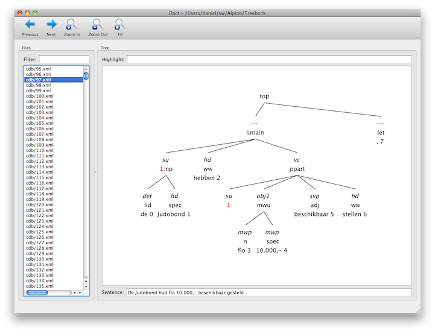
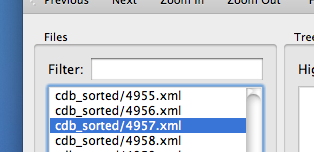
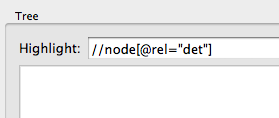
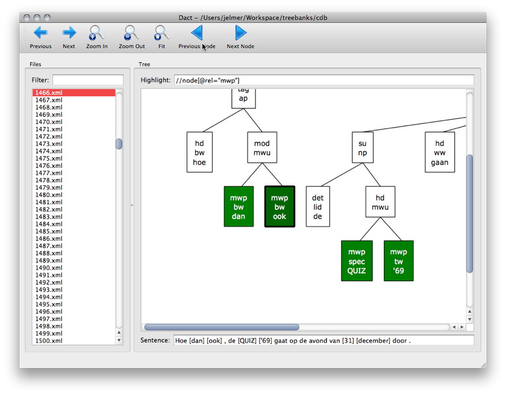
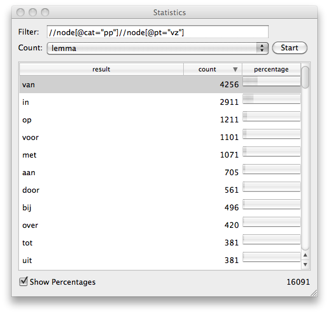
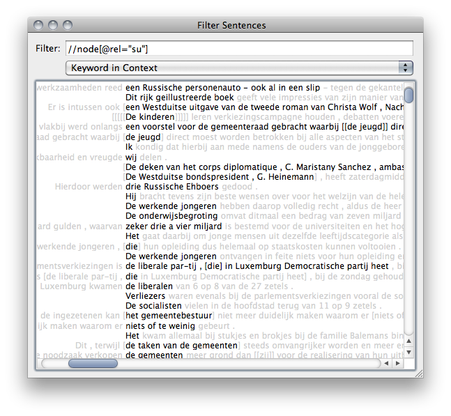

## Introduction

If Dact could be started correctly, you can open a corpus in Dact. Dact
supports three kinds of corpora:

 * Dact corpora (recognizable by the *.dact* extension). Use of this corpus
   format is strongly recommended, because it has superior performance in
   query processing.
 * Compact corpora, consisting of a data and index file (recognizable by
   the *.data.dz* and *.index* extensions).
 * Directory corpora, which are directories that contain parses.

Dact and compact corpora can be opened using the *Ctrl+o* keyboard shortcut,
directory corpora using the *Ctrl+d* shortcut (on OS X, use Cmd instead
of Ctrl). This will show a dialog that allows you to open the corpus. If you
prefer, you can use the *File - Open...* and *File - Open Directory...*
menu items as well.

After opening a corpus, the window will resemble that in the screenshot
above. The main Dact Window consists of two panes:

 * The entries pane (left) shows the list of corpus entries, here you can
   browse and select entries.
 * The detail pane (right) will contains more information about the entry
   that is selected in the left pane. This information consists of a
   sentence and the associated dependency tree.

Although the corpus can be browsed entry by entry, most functionality of
Dact is query-driven. After a short introduction to the query language in
the next section, you will be prepared to use other functionality of Dact.

## Queries

Queries are written in the [XPath](http://en.wikipedia.org/wiki/XPath) query language. 

### Matching a node

Every node in the tree is represented as an *node* element. You can match any node in the tree by using two forward slashes:

    //node

Of course, normally, you'd want to match nodes with certain restrictions based on attributes of a node. Such restrictions can be entered between square brackets (*[* and *]*). And attributes are prefixed by the 'at' sign (*@*). Commonly-used attributes are:

* **rel**: relation label
* **cat**: category
* **pos**: part of speech tag
* **root**: the root/stem of a lexical node

For instance, the following query will match all nodes with the *pos* attribute, or in other words lexical nodes:

    //node[@pos]

We can also restrict the selection by requiring that an attribute has a specific value using the equals sign (*=*). For instance, the following query will match all nodes, which have a *pos* attribute with the value *det*:

    //node[@pos="det"]

Such conditions can also be combined. Using the *and* operator will require both conditions to be true, while the *or* operator requires one of the conditions to be true. The following query will match all nodes with a *su* dependency relation, that also have *det* as their part of speech tag:

    //node[@rel="su" and @pos="det"]

There are some functions available in XPath which may be useful. For example using *not* we could find any node that doesn't match a certain condition. Say we want to match everything except nouns, we could write:

    //node[not(@pt="n")]

Or say we wanted to match everything except nouns that are lexical nodes starting with the letter *v*. We can use the *starts-with* function to require that the *root* attribute starts with the text *v*. The *and* operator will tie them together.

    //node[not(@pt) and starts-with(@root, "v")]

*contains* is another function that works just like *start-with*, except it match if the text is found anywhere in the attribute's value, not just at the beginning.

We can also make queries based on the structure of a tree. For example, the following query will match any node with a *su* dependency relation that has a determiner: one of the children of the matching node is a node which *pos* attribute has the value *det*.

    //node[@rel="su" and node[@pos="det"]]

Now that query matched the *su* node, but we can also match the *det* node. This is useful in the Statistics Window, where the matching nodes are read. This query will do just that:

    //node[@rel="su"]/node[@pos="det"]

It first finds the subject nodes, and then matches all the determiners found in these nodes. We can continue this to for example find all the nouns in the noun phrase in a preposition phrase. We first find the preposition phrase somewhere in the tree (mind the double slash), then find the noun phrase among one of it's children (the single slash), and then find a noun among the noun phrase it's children.

    //node[@cat="pp"]/node[@cat="np"]/node[@pt="n"]

This goes down deeper into the tree, but we can also move back up in the tree using double dots. Say we wanted to select all the siblings of a noun node, we can use .. to move up to the parent of the noun node, and then select all the children of this parent node:

    //node[@pt="n"]/../node

Or we could select all nodes of which the parent node has a child node which is a noun:

    //node[../node[@pt="n"]]

Note that strings, i.e. the text between quotes and attributes can be used interchangeably since an attribute has a string as a value. For example, say we would want to do something silly and try to find all lexical nodes with an attribute *pt* that has the same value al the word of the node, which would mostly be just the letter *n*. The word is accessible through the *word* attribute. So we end up comparing the *word* attribute with the *pt* attribute:

    //node[@pt=@word]

And we are not just bound to the attributes of the current node. Say we wanted to find examples the dutch verb *krijgen* used in a passive form. To do this, we have to look for sentences where the subject of the sentence is also the object of the verb phrase. A translation takes place. In the corpus this is indicated by an *index* attribute. This attribute contains the same value on both nodes. Ie. when we want to see translation 1, this query will highlight both the nodes before and after the translation:

	//node[@index=1]

Now using that knowledge we can find the node which contains the verb *krijgen*, a subject, and a object in the verb complement which both share the same value for *index*:

    //node[ node[@rel="hd" and @root="krijg"] and node[@rel="su"]/@index=node[@rel="vc"]/node[@rel="obj2"]/@index ]

(This query was taken from the [manual for Treebank Tools](http://www.let.rug.nl/~vannoord/alp/Alpino/TreebankTools.html), which contains some more interesting queries.)

Please do note that Dact expects queries that return nodes. A highlight query returning the value of an attribute of a node won't highlight any nodes.

## Filtering a corpus

The left pane shows a list of corpus entries, where each entry represents a parsed sentence. When viewing large corpora, it is often more interesting to look at particular entries. You can filter a corpus using an XPath query, where only the entries with nodes matching the query will be shown. A filter query can be typed in the field above the list of corpus entries:

After typing the query, press the *Enter* key, and Dact will start filtering the corpus. If you want to interrupt filtering, press the *Esc* key.

Using *Next* and *Previous* arrows in the top left menu bar, you can walk through each found entry. Or you can use the *Ctrl+Down* and *Ctrl+Up* shortcuts.

## Highlighting

After selecting an entry, its parse tree is shown in the right pane. All nodes matching an XPath query can be highlighted, this makes it easier to spot interesting phenomena. Entries can be highlighted by entering an XPath query:

Initially, the filter query is copied as the highlight query.

Matching nodes will be highlighted in the tree in green. The buttons *Zoom In* and *Zoom Out* can be used to scale the tree. *Previous Node* and *Next Node* will walk you through all the matching nodes. You can use *Ctrl+Left* and *Ctrl+Right* as well. This node will then be marked by a slightly thicker border. When zoomed in, it also focusses on the node, making sure it is visible. Normally, the scroll wheel is used for panning the tree. but when you press *Ctrl*, scrolling will zoom the tree. *Ctrl+=* and *Ctrl+-* can also be used to zoom in and out, and *Ctrl+0* resets the zoom level to show the whole tree.

The leaf nodes have tooltips showing more details about the node.

Below the tree the bracketed sentence is shown, and the parts in the sentence represented by the matching nodes are surrounded by square brackets.

## Gathering statistics

The Statistics window can be found in the *Tools* menu, or using *Ctrl+t*.

The Statistics window shows which values can be found for a certain attribute of the matching nodes throughout the corpus. These nodes can be filtered using the same XPath queries. If a node does match the filter, but does not have the attribute, it won't be counted.

Make sure to use a filter which matches the nodes you want to know the values of. For example, say we wanted to know how often every preposition occurs in a preposition phrase. We need to filter for the preposition nodes that are children of a preposition phrase node:

    //node[@cat="pp"]/node[@pt="vz"]

If you are unsure whether your filter will match too much or too little, try to test it visually in the tree by using it as the highlight query.

Because we want to know how often the word occurs, we select *word* or *lemma*.

The *result* column shows all the distinct values found, and the *count* column shows how often these values where encountered. The *percentage* column puts this number into perspective by showing how much this is as a percentage of the total count of found values. This total is shown in the bottom right of the window.

You can double-click one of the rows to search for all nodes that together are summed up in that row.

## Bracketed sentences

To quickly get an impression which part of a sentence matches a query, you can use the *Bracketed sentences* window in the *View* menu. Or by using *Ctrl+b*.

The window shows the part of a sentence which matches the query between brackets for all the sentences in the corpus where at least one matching node is found. Single clicking on one of these sentences will draw its tree in the Main Window. Double clicking a sentence will bring the Main Window with the tree to the front.

You can select alternative display modes using the dropdown menu. Currently three methods are implemented:

 * *Complete Sentence* shows the matching nodes in the sentence on a different background. Nested matches have a more opaque background.
 * *Only Matches* shows only partial sentences of the nodes that matched. One match or nested match per line. Currently because of the way this view is implemented the matches cannot be sorted.
 * *Keywords in Context* shows all the matches directly underneath each other and prints the rest of the sentence left and right of the match. The colors can be configured in Dact's preference window.
