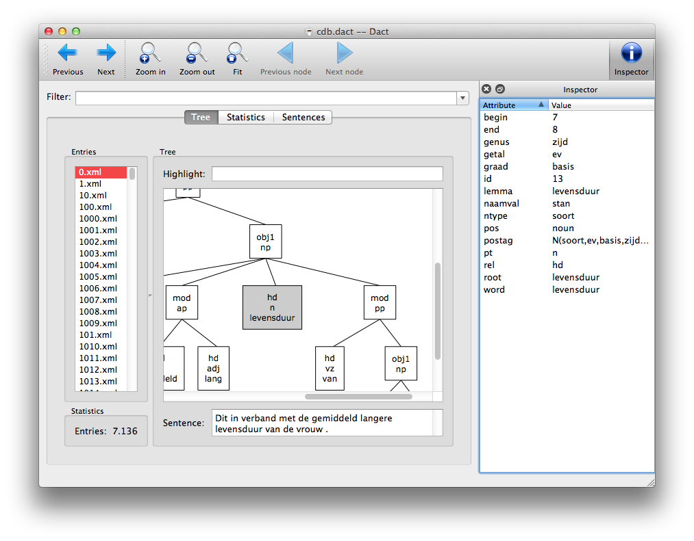
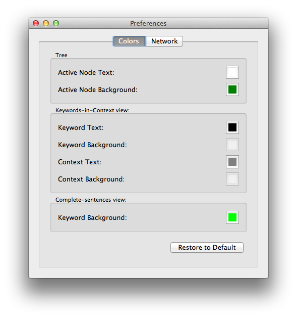

* Table of Contents
{:toc}

## Introduction

Dact is an application for browsing and searching syntactically
annotated treebanks such as Lassy Small and Lassy Large. This manual
provides an introduction to the Dact interface and its query language.
If you are already familiar with Dact and want to see a more in-depth
treatment of interesting linguistic phenomena, you might be interested
in the [Dact Cookbook](../cookbook).

## Installing and starting Dact

Dact for Windows, Mac OS X, and Ubuntu can be obtained via the [Dact
website](..). Here, we provide instructions for installing and starting
Dact.

### Windows

After downloading the Windows installer, run it. The installer will
copy Dact to your *Program Files* directory and add a *Start Menu* item.

On Windows XP, Vista, and 7, you can start Dact by clicking on the
*Start Menu* and selecting Dact from the list of programs. On Windows
Vista, 7, and 8, you can press the Windows key and type *dact*. Dact
should appear in the list of programs, where you can select it.

### Mac OS X

Dact is provided as a disk image. Click the on the disk image in your
browser or double click on the disk image in Finder to open it. Then
drag Dact to your *Applications* folder.

You can start Dact by double clicking on Dact in Finder. It's usually
faster to start Dact from Spotlight. Press *Cmd + Space* to open the
Spotlight search popup, type *dact*, and press *Return*.

Dact can also be installed with [Homebrew](http://brew.sh/):

    brew tap rug-compling/dact
    brew install dact

### Linux

Dact for Linux is distributed as a [Flatpak](https://flatpak.org/).
Flatpak is a distribution-independent software distribution format.
As a bonus, most Flatpak applications (including Dact) are sandboxed.

Some distributions (such as Fedora) include Flatpak by default. On
other distributions, including Ubuntu, you have to
[install Flatpak](https://flatpak.org/setup/). Once Flatpak is available,
you can install Dact with the following commands:

~~~
# Ensure that the Flathub repois available
flatpak remote-add --if-not-exists --user flathub https://dl.flathub.org/repo/flathub.flatpakrepo

# Add the Dact flatpak repo.
flatpak remote-add --user dact https://flatpak.danieldk.eu/dact.flatpakrepo

# Install Dact.
flatpak install --user dact eu.danieldk.Dact//stable
~~~

After the installation, Dact is immediately available in any XDG-compliant
desktop environment (GNOME, KDE, etc.). For instance, to start Dact in GNOME,
press the *Super* (Windows) key to bring up GNOME's search interface,
type *dact*, and press *Return*.

You can update Dact using Flatpak as well:

~~~
flatpak update

# Or for Flatpak versions older than 0.10.2:
flatpak update --user
~~~

It is also possible to install a development version of Dact:

~~~
flatpak remote-add --user dact https://flatpak.danieldk.eu/dact.flatpakrepo
flatpak install --user dact eu.danieldk.Dact//master
~~~

## Getting started

Once Dact is started, the *Open Corpus* dialog will pop up:

You have three options to open a corpus:

* **Opening a publicly available corpus:** The dialog shows a list of
  corpora that are publicly available. Selecting a corpus from the list
  will open it. If the corpus is not available on your computer, Dact
  will download it for you.

* **Opening another corpus:** If you have a corpus that is not publicly
  available, such as Lassy Small, you can open it by clicking on the
  *Open local file* button (or press *Ctrl+l* or *Cmd+l on a Mac) and
  selecting that corpus.

* **Opening a directory with corpora:** You can also open a directory
  with corpora using the *Open directory* button. This is especially
  useful for large corpora, such as Lassy Large, which are distributed
  as a collection of smaller Dact corpora.

After opening a corpus, the window will resemble the following:

The main Dact Window consists of a filter field and three tabs:

-   The Tree tab shows all entries with matching nodes in the corpus
    that match your filter query. You can click on an entry to show its
    dependency tree. You can also open the Inspector using the button in
    the upper right corner (*Ctrl+i*) and inspect the attributes of
    individual nodes in the dependency tree by selecting them.

-   The Statistics tab shows the frequency of values of a specific
    attribute for all the nodes in the corpus that match your filter
    query. You can specify which attribute you want to count with the 
    dropdown menu on this tab.

-   The Sentences tab shows the entries containing matching nodes as
    sentences, and highlights them. 

Although the corpus can be browsed entry by entry, most functionality of
Dact is query-driven. After a short introduction to the query language
in the next section, you will be prepared to use other functionality of
Dact.

## Queries

Queries are written in the [XPath](http://en.wikipedia.org/wiki/XPath)
query language.

### Matching a node

Every node in the tree is represented as an *node* element. You can
match any node in the tree by using two forward slashes:

    //node

Of course, normally, you would want to match nodes with certain
restrictions based on the context or specific attributes of a node. 
Such restrictions can be entered between square brackets (`[` and `]`). Attributes are
prefixed by the ‘at’ sign (`@`). Commonly-used attributes are:

rel
:   relation label

cat
:   category

postag
:   part of speech tag

pt
:   abbreviated part of speech tag

lemma
:   the lemma of a lexical node

word
:   the word of a lexical node

For instance, the following query will match all nodes with the *postag*
attribute, or in other words lexical nodes:

    //node[@postag]

We can also restrict the selection by requiring that an attribute has a
specific value using the equals sign (*=*). For instance, the following
query will match all nodes, which have a *postag* attribute with the value
*BW()*:

    //node[@postag="BW()"]

Such conditions can also be combined. Using the *and* operator will
require both conditions to be true, while the *or*operator requires one
of the conditions to be true. The following query will match all nodes
with a *mod* dependency relation, that also have *det* as their part of
speech tag:

    //node[@rel="mod" and @postag="BW()"]

There are some functions available in XPath which may be useful. For
example using `not` we could find any node that does not match a certain
condition. Say we want to match everything except nouns, we could write:

    //node[not(@pt="n")]

Or say we wanted to match everything except nouns that are lexical nodes
starting with the letter *v*. We can use the `starts-with` function to
require that the *word* attribute starts with the text *v*. The *and*
operator will tie them together.

    //node[not(@pt) and starts-with(@word, "v")]

`contains` is another function that works just like `starts-with`, except
it matches if the pattern is contained in the value of the attribute.

We can also make queries based on the structure of a tree. For example,
the following query will match any node with a *su* dependency relation
that has an adverb: one of the children of the matching node is a
node of which the *postag* attribute equals *BW()t*.

    //node[@rel="su" and node[@postag="BW()"]]

Now that query matched the *su* node, but we can also match the adverbial
node. This is useful in the Statistics Window, where the matching nodes
are used to determine the frequencies. This query will do just that:

    //node[@rel="su"]/node[@postag="BW()"]

It first finds the subject nodes, and then matches all the adverbs
found in these nodes. Similarly, a query can be constructed which 
selects nouns in the noun phrase of a prepositional phrase. We first find the
prepositional phrase somewhere in the tree (mind the double slash), then
find the noun phrase among one of its children (the single slash), and
then find a noun among the children of the noun phrase.

    //node[@cat="pp"]/node[@cat="np"]/node[@pt="n"]

This goes down deeper into the tree, but we can also move back up in the
tree using double dots. Say we wanted to select all the siblings of a
noun node, we can use .. to move up to the parent of the noun node, and
then select all the children of this parent node:

    //node[@pt="n"]/../node

Or we could select all nodes with a parent node with a child node
which is a noun:

    //node[../node[@pt="n"]]

Note that strings, i.e. the text between quotes and attributes can be
used interchangeably since an attribute has a string as a value. For
example, we could identify nodes with a @lemma value that is identical to
the @word value as follows:

    //node[@lemma=@word]

And we are not just bound to the attributes of the current node. Say we
wanted to find examples the dutch verb *krijgen* used in a passive form.
To do this, we have to look for sentences where the subject of the
sentence is also the object of the verb phrase. 
In the corpus this is indicated by an *index* attribute. This
attribute contains the same value on both nodes. 
We can find the node which contains the verb
*krijgen*, a subject, and a object in the verb complement which
share the value for *index*:

    //node[ node[@rel="hd" and 
                 @root="krijg"] and 
            node[@rel="su"]/@index=
            node[@rel="vc"]/node[@rel="obj2"]/@index 
          ]

> **Note**
>
> When using the position attributes, `@begin` and `@end`, note that
> XPath sees them as strings. If you want to compare them, you may want
> to convert them to numbers first using `number()`. For example:
>
>     //node[@cat="pp" and 
>            node[@rel="hd"]/number(@begin) > 
>            node[@rel="obj1"]/number(@begin)
>           ]

> **Note**
>
> Please do note that Dact expects queries that return nodes. A
> highlight query returning the value of an attribute will not highlight any
> nodes.

### Exploring a corpus

The left pane on the Tree tab shows a list of corpus entries, where each
entry represents a sentence containing at least one node that
matched your filter query.

After typing a query, press the *Enter* key, and Dact will start
listing entries which match the query. If you want to interrupt the query
processing (e.g. because you have seen enough hits), simply press the
*Esc* key. 

The query widget keeps track of your previous queries. You can pick one of your 
previous queries form the history using the arrow on the right of the filter field,
and adapt the query if so desired.

Using the *Next* and *Previous* arrows in the top left menu bar, you can
walk through each found entry. Or you can use the *Ctrl+Down* and
*Ctrl+Up* shortcuts.

### Highlighting nodes

After selecting an entry, its analysis is shown in the right pane. To
to spot interesting phenomena, or test a query, you can enter a
separate query in the highlight field. Each node matching the highlight
query will be colored:

Initially, the filter query is used as the highlight query.

Matching nodes will be highlighted in the tree in green (you can alter
this color in the Preferences). The buttons *Zoom In* and *Zoom Out*
can be used to scale the tree. *Previous Node* and *Next Node* will guide you
through all the matching nodes. You can use *Ctrl+Left*
and *Ctrl+Right* as well. The node in focus will then be marked by a
slightly thicker border. Normally, the scroll wheel is used for panning
the tree. but when you press *Ctrl*, scrolling will cause the tree to
scale. *Ctrl+=* and *Ctrl+-* can also be used to zoom in and out, and
*Ctrl+0* resets the zoom level to show the full tree, just like *Fit*
button on the toolbar does.

The leaf nodes have tool tips showing more details about the node.

Below the tree the sentence is shown, and the parts in the sentence
that are part of the matching nodes are highlighted.

### Inspecting nodes

If you want to know more about a node, you can select it and open the
Inspector by clicking its button on the right hand side of the toolbar,
pressing *Ctrl+i* or by enabling it in the *View* menu. This is very
useful for writing queries.

The Inspector will show you all attributes with the corresponding values of the node in focus. You
can right-click an attribute and use the context menu to directly add it
to your search query.

> **Tip**
>
> The Inspector is detachable and can be torn off the Main window.

### Gathering statistics

The Statistics tab shows which values can be found for a certain
attribute of matching nodes. If a node does match the
query, but does not have the attribute, it will be counted as *[missing
attribute]*.

Make sure to use a query which matches the nodes you want to know the
values of. For example, say we wanted to know how often every
preposition occurs in a prepositional phrase. We need to filter for the
preposition nodes that are children of a preposition phrase node:

    //node[@cat="pp"]/node[@pt="vz"]

If you are unsure whether your filter will match too many or too few
nodes, try to test it visually in the Tree tab by using your query as
the highlight query.

Because we want to know how often the word occurs, we can select the `word`
attribute (or perhaps the `lemma` attribute) from the drop-down menu.

The *Value* column shows all the distinct values found, and the *Nodes*
column shows how often nodes with these values where encountered. The
*percentage* column puts this number into perspective by showing how
much this is as a percentage of the total count of found values. The
total is shown in the bottom right of the window, as is the number of
distinct values (i.e. the number of rows in the table).

You can double-click one of the rows to search for all nodes that
together are summed up in that row. Dact will automatically generate a
new filter query for you.

When copying rows to the clipboards, they will be pasted as a
tab-separated plain-text table. Excel and many other programs are able
to import this format when pasting it into a document.

### Exporting Statistics

The results from the Statistics tab can be saved in various formats:
plain text, HTML, Excel worksheet and CSV. Go to the *File - Save as…*
menu and select the file type from the drop-down menu in the save
dialog.

> **Tip**
>
> Note that this menu item also works in the *Sentences* tab.

### Sentences

To get an impression which parts of sentences matches a query,
you can use the *Sentences* tab.

The window highlights the part of a sentence which matches the query for
all the sentences in the corpus where at least one matching node is
found.

You can select alternative display modes using the drop-down menu.
Currently three methods are implemented:

-   *Complete Sentence* shows the matching nodes in the sentence on a
    different background. Nested matches have a more opaque background.
    The color can be changed in Dact's Preference Window.

-   *Only Matches* shows only the words contained in the nodes that
    matched your query.

-   *Keywords in Context* shows all the matches directly underneath each
    other and prints the rest of the sentence left and right of the
    match. The colors can also be configured in Dact's Preference
    Window.

## Converting corpora

For many users, the functionality described in this section is not
relevant.

Dact can only work with Dact corpora. However, it also provides
functionality to convert a directory of XML files or a compact corpus
to the Dact format. To convert such a corpus,
go to the *Tools - Convert corpus* submenu, and choose your type. Dact
will prompt you for the location of your corpus, and where to save the
new Dact corpus. Afterwards you can open the newly created Dact corpus
using the *File - Open…* menu item.

> **Note**
>
> Note that *your original corpus won't be affected* in this process.

### Converting TüBa-D/Z

TüBa-D/Z is (also) delivered in XML format (ExportXML). In contrast to
Dact, this uses one XML document for the whole treebank. You can convert
the ExportXML to a format usable by Dact using a [Python script](https://raw.githubusercontent.com/rug-compling/dact/master/util/tdz-explode.py):

    iconv -f latin1 -t utf8 tuebadz-9.0-exportXML-v2.xml > tuebadz-9.0-exportXML-v2-utf8.xml
    mkdir tuebadz
    cd tuebadz
    python ../tdz-explode.py tuebadz-9.0-exportXML-v2-utf8.xml

You can then convert the *tuebadz* directory corpus as described above.

## Configuring Dact

Dact has some preferences that you can change, such
as the font and colors of the interface. You can find
these in the Preference window, which you can find in *Edit* menu. (On
OS X, you will find it in the application menu like any other OS X
application.) Changes are automatically applied and saved.

If you accidentally mess up, you can always revert to the default
preferences that Dact ships with, by clicking the *Return to Default* button
in a tab. The preferences will be restored to their default values.

### Font and colors

Dact allows you to choose your own colors and font used in the
interface to some extent.

Note that the OS X version of Dact does not have a *Font* tab. In the
other versions of Dact you can change the font that is used for the
buttons and lists throughout Dact.

### Network

Dact's *Download corpus*, *Open remote corpus* and *Parse sentences*
features use web services to function. The addresses of these web
services can be changed.

> **Note**
>
> Note that not all of these features may be enabled in your version of
> Dact, as of the time of writing not all of the required web services
> are publicly available.

## Macros

Dact supports macros in its XPath queries. You can insert simple
placeholders in your query which are expanded before a query is
evaluated. A placeholder is the name of the macro surrounded by
percentage signs (`%`). A set of macros can be stored in a 
separate file, which you can load from Dact.

### Using a macro

Given you have loaded a file with the following macro:

    interesting = """ @rel="su" or @rel="vc" """

When you enter the following query in to the filter query field:

    //node[%interesting%]

Dact replaces the placeholder, and executes the following query:

    //node[ @rel="su" or @rel="vc" ]

Since Dact only does simple text replacement, you can also use invalid
or partial XPath code as replacement. As long as the expanded query is
valid, Dact will accept it.

### Loading a file with Macros

You can load a file with macros with the *Macros - Load file…* menu
item. When the file is successfully loaded, a submenu with the same name
as the filename is visible in the *Macros* menu, containing all the
macros in the file.

When you have focused one of the XPath query fields in Dact, you can
select one of the macros from the *Macros* menu to insert it at the
position of your text cursor.

### Macro file syntax

Macro files are rather simple and can be created with any plain text
editor. Macros have the following syntax:

    placeholder = """replacement"""

`placeholder` is the name of your macro, and `replacement` the XPath
code it will be replaced with. The name and replacement are separated by
a `=`, and the replacement has to be surrounded by three pairs of double
quotes. `replacement` may span several lines.

Dact also expands macros while loading them. This way, you can use
macros that were defined before in the same file.

    b = """number(@begin)"""
    e = """number(@end)"""

    headrel = """ ( @rel="hd" or @rel="cmp" or @rel="mwp" or @rel="crd" or 
                    @rel="rhd" or @rel="whd" or @rel="nucl" or @rel="dp") """

    precedes_head_of_smain = """
    (  ancestor::node[@cat="smain"]/
                 node[@rel="hd"]/%b% 
               > node[%headrel%]/%b% 
       or 
       ancestor::node[@cat="smain"]/
                 node[@rel="hd"]/%b% 
               > %b% and @pos
    )
    """

All lines which start with # are treated as comments.

## Tools

### Using tools

In both the Tree and Sentences tabs the individual files matching your
filter query are shown. You can add additional entries to the context
menu for these files by configuring tools. For example, you could
configure a text editor to show the raw XML data of the selected
sentence.

If you have selected multiple files, Dact will start the selected tool
once for each file.

### Configuring tools

The path to a tools configuration file can be set in the Preferences of
Dact. Once the path is set, the file is loaded when you open the tools
context menu. If you update the file after that, Dact will reload it
automatically.

### Tools configuration file syntax

The syntax of the tools configuration file looks a lot like the one used
by the macros. In addition to this, you can use `%1` as placeholder for
the filename of the selected file as shown by Dact in the Tree tab. For
example, to define an "Edit Text" menu entry:

    Edit Text = """gedit "~/treebanks/cdb/%1""""

> **Tip**
>
> In this example the complete path is surrounded by quotes, as the
> filename may contain spaces.

Unfortunately, the XML files Dact uses are not accessible outside of the
Dact database files. But if you have the raw XML files installed
somewhere (e.g. in `~/treebanks/cdb`), you can refer to those.

### Tools for a specific treebank

Because you cannot let the tools interact with the treebank, you might
need to configure your tools differently for each treebank you use. E.g.
your `cdb.dact` might need to use the files in `~/treebanks/cdb` while
you have all your XML files for `wikipedia.dact` in
`/net/shared/treebanks/wikipedia`.

To allow you to specify a tool for just a few specific treebanks, you
can add subsections to your tools configuration file with the path of
the treebank files as name. Fortunately, you can use wildcards in these
filenames. Only when the path of the currently loaded treebank matches
this pattern, all tools in this subsection will be shown in the tools
context menu.

    mark = """bash -c "echo \"%1\" >> ~/marked_entries.txt" """

    [*/cdb.dact]
    show xml = """gedit "~/treebanks/cdb/%1""""
    email name = """bash -c "echo \"%1\" | sendmail -v someone@domain" """

    [*/wikipedia*.dact]
    show xml = """gedit "/net/shared/treebanks/wikipedia/%1""""

## Common problems

### The application failed to initialize properly (0xc0000022)

If you get the error
`The application failed to initialize properly (0xc0000022)` it means
that something is wrong with the DLL permissions. Presumably with the
.dll files in the Dact distribution.

You can fix this problem by opening a command prompt, and cd to the
directory in which the Dact files reside. Then type:

    cacls *.dll /E /G BUILTIN\Users:R
